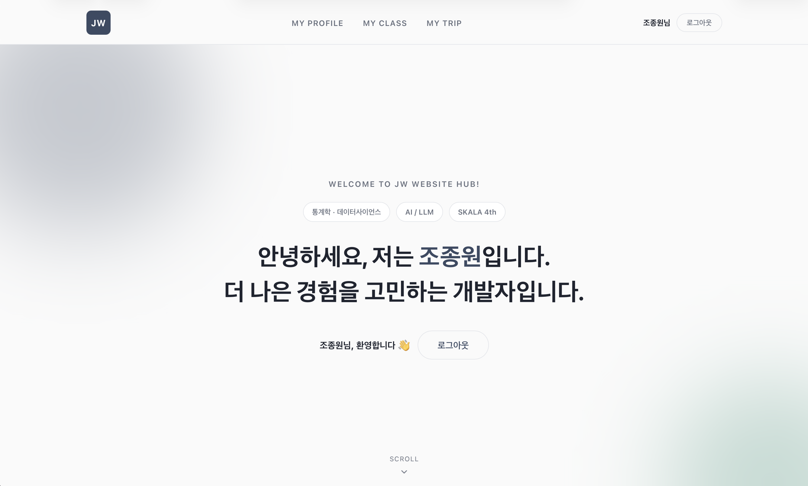
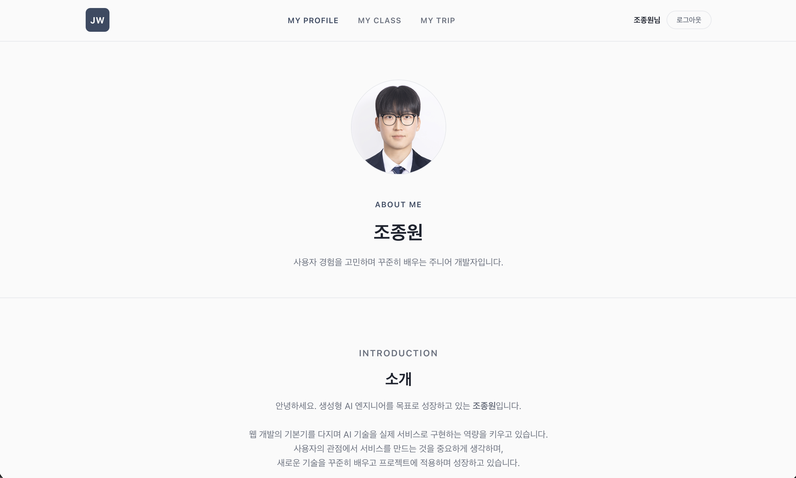
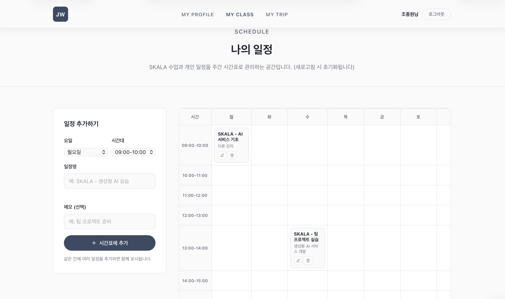

# **SKALA-front**

저의 개인 포트폴리오 허브 사이트입니다.  
자기소개, 기술 스택, 프로젝트, 일정, 여행 기록을 한곳에서 확인할 수 있고, 회원가입·로그인을 통해 방명록 작성이나 일정 편집 같은 추가 기능을 이용할 수 있습니다.


## 페이지 구성
 
| 파일 | 설명 |
|---|---|
| `index.html` | 홈 — 자기소개, 미니 게임, 실시간 날씨, 방명록 |
| `html/myProfile.html` | 프로필 — 소개, 기술 스택, 경력·교육, 프로젝트 |
| `html/myClass.html` | 일정 — 주간 시간표, 장기 일정 관리 |
| `html/myTrip.html` | 여행 기록 — 갤러리, 하이라이트 영상/음악 |
| `html/signUp.html` | 회원가입 |
| `html/signUpResult.html` | 회원가입 완료 안내 |

## **주요 기능(Function)**
 
- **회원가입 / 로그인** — 이메일·비밀번호 기반, `localStorage`에 가입자 정보와 로그인 세션 저장
- **방명록** — 누구나 조회 가능, 로그인한 사용자만 작성 가능
- **미니 게임** — 업다운 숫자 맞추기(로그인 시 Top 10 기록 저장), 성적 계산기, 가방 보기
- **실시간 날씨** — Open-Meteo API로 도시별 기온·습도 조회
- **일정 관리** — 주간 시간표 + 장기(월간·연간) 일정, 로그인해야 추가·수정·삭제 가능 (비로그인은 조회만)
- **여행 기록** — 국내/해외 필터링 갤러리, 여행 하이라이트 영상·배경음악

## **Stacks** 
 
### Environment


 
### Development


 
### API


## **화면 구성**
 
<table>
  <tr>
    <th align="center">홈</th>
    <th align="center">프로필</th>
  </tr>
  <tr>
    <td align="center">
        <br>
        <sub>미니 게임, 실시간 날씨, 방명록 포함</sub>
    </td>
    <td align="center">
        <br>
        <sub>소개, 기술 스택, 경력 및 교육, 프로젝트</sub>
    </td>
  </tr>
  <tr>
    <th align="center">일정</th>
    <th align="center">여행 기록</th>
  </tr>
  <tr>
    <td align="center">
        
        <sub>주간, 장기 일정 (로그인 시 편집 가능)</sub>
    </td>
    <td align="center">
        
        <sub>국내외 사진, 하이라이트 영상 및 음악</sub>
    </td>
  </tr>
  <tr>
    <th align="center">회원가입</th>
    <th align="center">회원가입 완료</th>
  </tr>
  <tr>
    <td align="center">
        
        <sub>국내외 사진, 하이라이트 영상 및 음악</sub>
    </td>
    <td align="center">
        
        <sub>국내외 사진, 하이라이트 영상 및 음악</sub>
    </td>
  </tr>
</table>


## **아키텍처(Architecture)**
**디렉토리 구조**
```
├── index.html            # 홈 (루트에 위치)
├── html/                 # 홈을 제외한 나머지 페이지
│   ├── myProfile.html
│   ├── myClass.html
│   ├── myTrip.html
│   ├── signUp.html
│   └── signUpResult.html
├── css/
│   └── style.css         # 전체 페이지 공통 스타일시트 (1개 파일)
├── script/                # 페이지별 로직 + 공용 스크립트
│   ├── index.js
│   ├── myProfile.js
│   ├── myClass.js
│   ├── myTrip.js
│   ├── signUp.js
│   ├── signUpResult.js
│   ├── weatherAPI.js      # 날씨 데이터 조회
│   └── realtimeInfo.js    # 날씨 화면(DOM) 업데이트
├── media/                 # 이미지, 영상, 음악 파일
├── screenshots/           # README용 스크린샷
└── README.md
```
